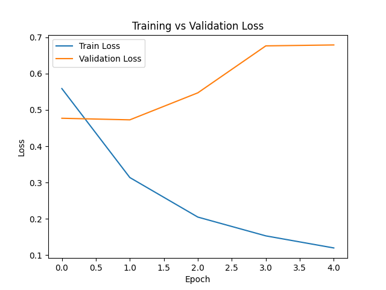

**Disaster Tweet Classifier (NLP)**
**Description**

This project implements a machine learning and neural network model to classify tweets as Disaster or No Disaster.

It includes a baseline TF-IDF + Logistic Regression model and a final LSTM model using Keras/TensorFlow.

The text data undergoes preprocessing (URL removal, stopwords removal, punctuation cleaning), tokenization, and sequence padding before being used for binary classification.

**Results**
**Baseline Model (TF-IDF + Logistic Regression)**
Precision    Recall    F1-score
0 (No Disaster)   0.78      0.90      0.84
1 (Disaster)      0.84      0.66      0.74
Accuracy: 0.80

**LSTM Model**
| Label | Precision | Recall | F1-score |
|-------|----------|--------|----------|
| 0 (No Disaster) | 0.78 | 0.90 | 0.84 |
| 1 (Disaster)    | 0.84 | 0.66 | 0.74 |
Accuracy: 0.77

**Confusion Matrix**
[[343  83]
 [ 96 240]]

**Training Plots**

Training vs Validation Loss

Training vs Validation Accuracy

Note: 

These plots were saved during model training and show the performance of the LSTM model over each epoch.

Note on Overfitting

The plots show that the LSTM model achieves very high accuracy on the training data (over 95%) while the validation accuracy plateaus around 75%. Additionally, the validation loss increases during the first few epochs and then stabilizes, even as the training loss continues to decrease. This indicates some overfitting, which is common for models trained on relatively small datasets.

Overfitting here means the model has learned the training examples very well, but its generalization to unseen data is limited. In practice, this can be addressed by techniques such as:

Adding more training data

Using regularization (e.g., dropout)

Implementing early stopping to prevent training beyond the point where validation performance stops improving

**How to Use**
1. Clone the Repository

git clone https://github.com/AthanasiosKon/disaster-tweet-classifier-nlp.git
cd disaster-tweet-classifier-nlp

2. Create Virtual Environment

conda create -n disaster-nlp python=3.10
conda activate disaster-nlp

3. Install Required Packages

pip install -r requirements.txt

4. Run the Model

python src/main.py

Important: On the first run, NLTK resources (punkt_tab and stopwords) will be automatically downloaded.
